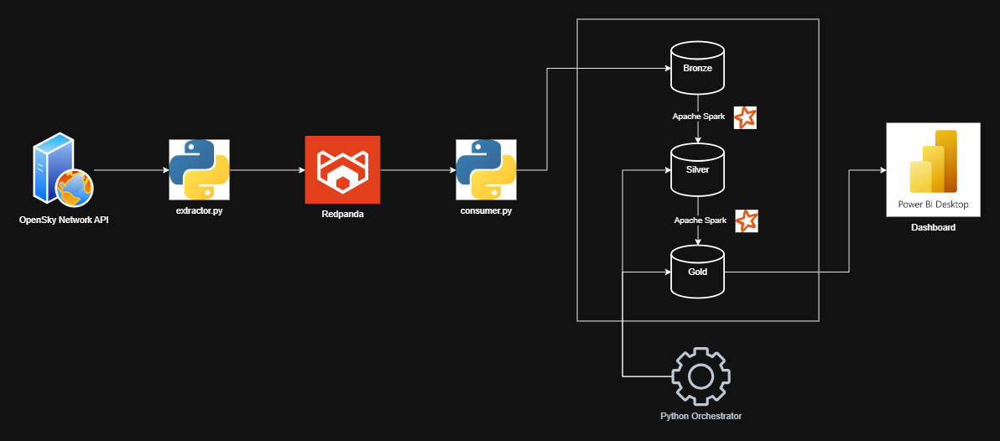
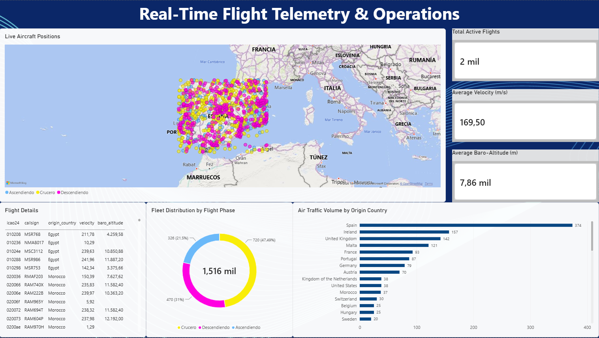

# Real-Time Flight Telemetry Data Platform

An end-to-end Data Engineering portfolio project that ingests, processes, and visualizes live aircraft telemetry data. This pipeline applies a Medallion Architecture (Bronze, Silver, Gold) over an on-premise streaming and batch processing environment.

## Architecture & Pipeline
1. **Extraction:** A custom Python extractor queries the OpenSky Network API every 5 minutes, handling rate limits and ensuring graceful shutdowns.
2. **Streaming Ingestion:** Real-time data streams into **Redpanda** (Kafka-compatible) to decouple extraction from downstream processing.
3. **Data Lake (Medallion Architecture):**
   - **Bronze:** Raw JSON data deserialized via PySpark and stored in partitioned Parquet files (`/date=YYYY-MM-DD`).
   - **Silver:** Cleaned and filtered records, dropping null coordinates and standardizing timestamps (`last_contact`).
   - **Gold:** Business-level aggregations. Utilizes SQL Window Functions (`ROW_NUMBER()`) for temporal deduplication (isolating the last known aircraft position) and generates feature-engineered dimensions (`flight_phase`).
4. **Orchestration:** A lightweight Python subprocess orchestrator handles the scheduled batch execution of the Silver and Gold layers, enforcing task dependencies and error handling.
5. **Visualization:** Power BI connects directly to the local Gold layer Parquet directories for real-time geographic and KPI tracking.



## Tech Stack
* **Languages:** Python 3.10+, SQL, Java 17
* **Processing:** PySpark 3.5 (Batch & Structured Streaming)
* **Message Broker:** Redpanda (Kafka-python)
* **Storage:** Local Data Lake (Parquet format)
* **Visualization:** Power BI Desktop

##  Command Center Dashboard


## How to Run Locally
1. Start Redpanda via Docker Compose:
   ```bash
   docker-compose up -d
2. Launch the real-time extraction and ingestion layers (separate terminals):
    ```bash
    python extractor.py
    python consumer.py
3. Start the batch orchestrator to process Silver and Gold layers every 15 minutes:
    ```bash
    python orchestrator.py
4. Open `./dashboard/real-time-flight-telemetry.pbix` in Power BI Desktop and hit "Refresh".
